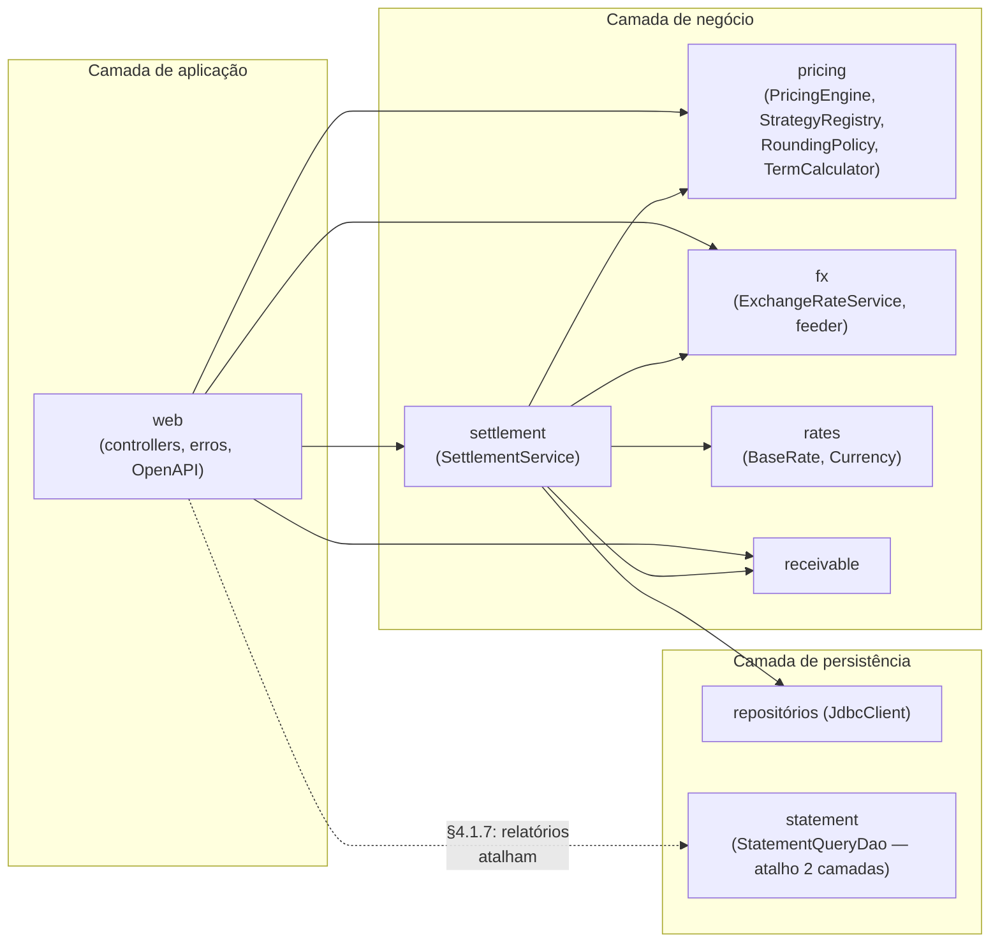

# ADR 0002 — Monólito modular vs. microserviços

## Status

Aceito — implementado em `backend/src/main/java/com/srmasset/creditengine/` (um deployable, pacotes por domínio).

## Contexto

O enunciado pede arquitetura em camadas (§4.1.7: "aplicação, negócio e persistência separadas; relatórios podem atalhar para duas camadas") e, ao mesmo tempo, **pune** explicitamente a alternativa distribuída: §12 lista "microserviços para um case" como anti-padrão da categoria "volume como proxy de qualidade". O escopo real é um domínio (cessão de crédito), um time (um autor), um banco, e um fluxo transacional — liquidação — cuja consistência forte é exigência do §4.1.3.

Um sistema distribuído aqui pagaria os custos (rede entre precificação e liquidação, transação distribuída ou saga para UPDATE+INSERT, N pipelines, observabilidade distribuída) sem receber nenhum benefício (não há times independentes, nem perfis de escala divergentes, nem domínios com ciclos de vida distintos — ainda).

## Decisão

**Monólito modular em 3 camadas, com pacotes por domínio e fronteiras desenhadas para extração:**

Regras de fronteira (as mesmas que valeriam entre serviços):

- **`pricing` é uma biblioteca pura**: sem I/O, sem Spring além da injeção; recebe `PricingRequest` + `PricingContext` e devolve `PricingResult`. É o motor que os golden cases aferem, testável em < 5 s.
- **`settlement` orquestra por interface**, nunca por tabela alheia: consome `ExchangeRateService`, `BaseRateRepository`, `PricingEngine`. Todo o I/O de resolução acontece **antes** da transação curta (ver comentário de classe do `SettlementService`).
- **`statement` só lê**: `StatementQueryDao` com SQL nativo e keyset — é o "relatório em duas camadas" que o §4.1.7 autoriza, e já é, na prática, um read model separado do write model.
- **`fx` tem direção única**: o provedor externo (mockado) **alimenta a tabela** `exchange_rates`; a liquidação lê o banco. O feeder já se comporta como um serviço de ingestão isolado.
- Comunicação entre pacotes por tipos do domínio (`Money`, `FxRate`, `MonthlyRate`) — nunca por entidade de persistência de outro módulo.

## Alternativas consideradas

| Alternativa | Por que não |
|---|---|
| **Microserviços** (pricing-svc, fx-svc, settlement-svc) | A transação UPDATE→INSERT viraria saga com compensação para um fluxo que cabe numa transação local de milissegundos; §12 trata isso como anti-padrão — corretamente, porque o custo operacional não compra nada neste escopo. |
| **Monólito em camadas técnicas** (controllers/, services/, repositories/) | Camadas horizontais espalham cada domínio por 3 pacotes; a coesão fica por convenção. Pacote por domínio torna a fronteira de extração visível no `import`. |
| **Modular monolith com enforcement de módulo** (Spring Modulith / ArchUnit) | Valeria num time; para um case, o enforcement é a revisão do próprio grafo de imports — os pacotes não têm dependência cíclica e `pricing` não importa nada de persistência. Adotar a ferramenta seria volume, não julgamento. |

## Consequências

- Positivas: uma transação local resolve o §4.1.3; um `docker compose up` sobe tudo; refatoração cross-domínio é um commit; a defesa ao vivo (mudança de 30–40 min, ex.: novo tipo de recebível) toca **um pacote** — nova classe registrada no `StrategyRegistry`, sem migração.
- Negativas: um deploy único — bug no extrato derruba a liquidação junto; escala é do processo inteiro (mitigado: o processo é stateless, escala horizontal atrás de LB, estado só no PostgreSQL); a disciplina de fronteira é por revisão, não por compilador.

## Contra-argumento mais forte — e a resposta honesta

**"Monólito não escala organizacionalmente: com times independentes, cada domínio precisa de deploy e ciclo próprios — e você vai reescrever tudo."**

Procede como critério de **quando** extrair, não de **começar** extraído. A resposta é que as fronteiras de extração já estão pagas: (1) `statement` é o primeiro candidato — só lê, já tem DAO próprio e viraria a projeção eventual do design de escala ([`escala-1m-tx-min.md`](../escala-1m-tx-min.md)); (2) `fx`/feeder é o segundo — já tem direção única e contrato via tabela interna; (3) `settlement` é o último e mais caro, e a rota dele está desenhada em [`eda-liquidacao.md`](../eda-liquidacao.md): a mesma transação curta ganha um INSERT de outbox e os consumidores nascem fora do monólito **sem tocar no fluxo síncrono**. Extrair serviço de um monólito com pacotes coesos é um trabalho de semanas; juntar microserviços mal cortados é um trabalho de anos. Na dúvida sobre onde passam as fronteiras — e num domínio novo a dúvida é certa — errar para o lado do monólito é o erro barato.
