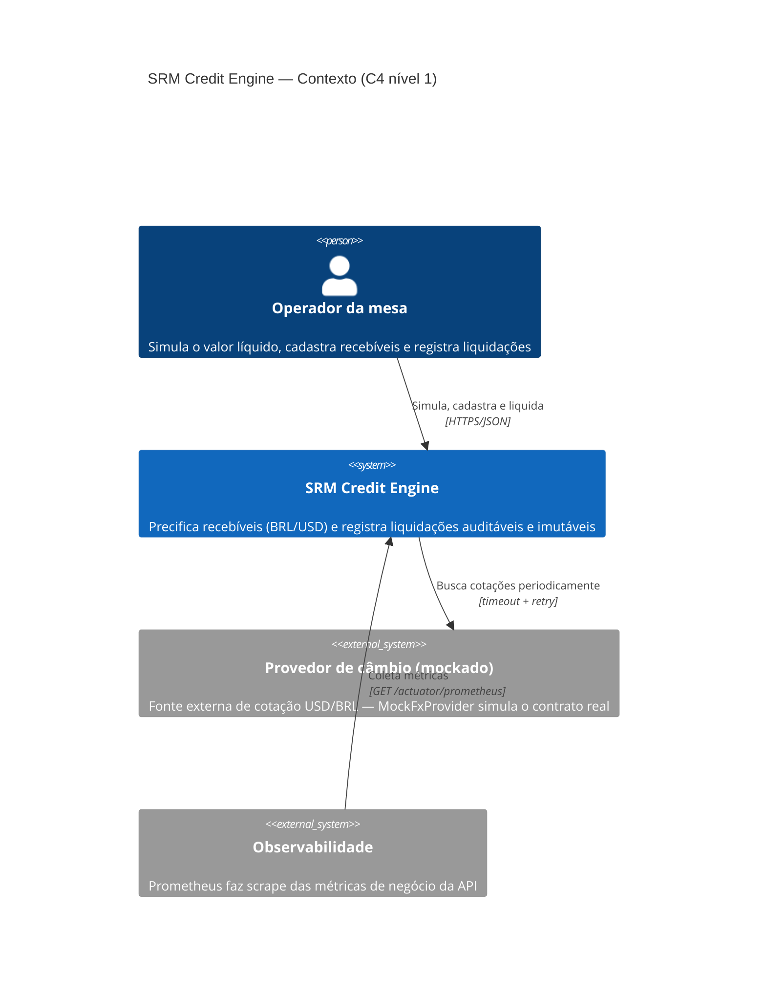
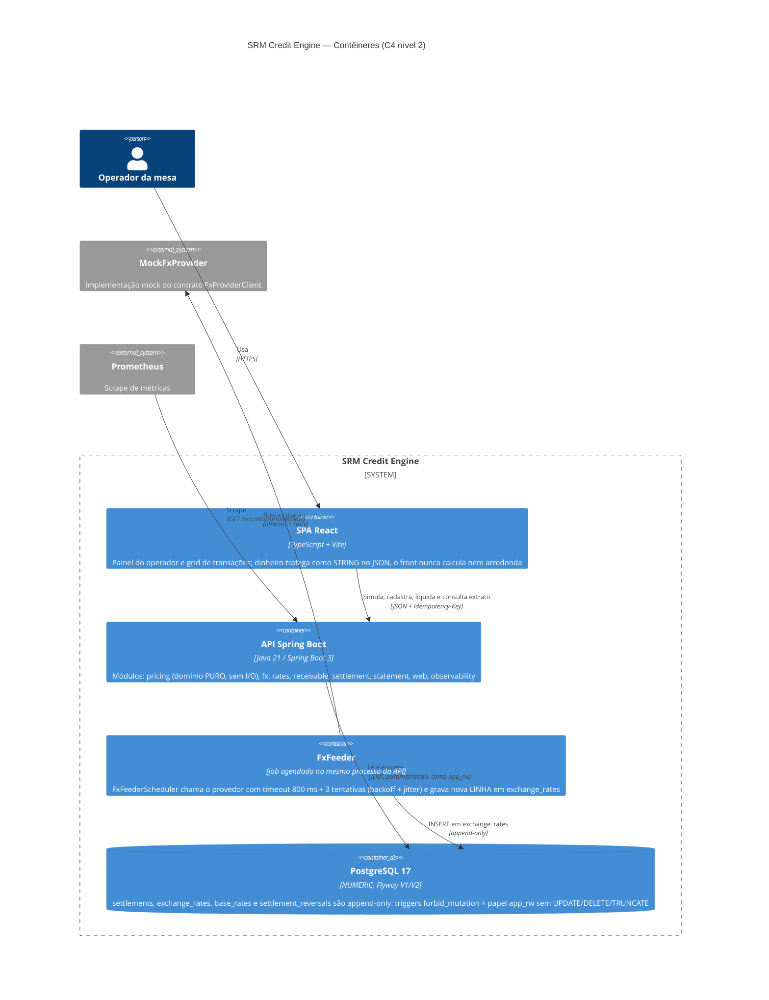

# Diagrama C4 — SRM Credit Engine

Níveis 1 e 2 (exigência sênior, §6 do enunciado), refletindo o sistema **real** deste
repositório — os nomes abaixo existem no código (`backend/src/main/java/com/srmasset/creditengine`).

## Nível 1 — Contexto

| Elemento | Legenda |
|---|---|
| Operador da mesa | Único ator do escopo; identificado pelo header `X-Operator` (auth real fora do escopo — premissa **B14** do `SPEC.md`) |
| SRM Credit Engine | O sistema deste repositório: motor de precificação + registro de liquidação |
| Provedor de câmbio (mockado) | Sistema externo simulado; só **alimenta** a tabela interna de cotações — a liquidação nunca o chama (premissa **B15**) |
| Observabilidade | Sistema externo que consome `/actuator/prometheus` (métricas `settlements{outcome,currency}` e timer `pricing.engine`) |

> **Fora do escopo (declarado):** o **pagamento efetivo** ao cedente — administrador/custodiante do
> FIDC — não é sistema deste desenho ("liquidar" aqui = registrar; `SPEC.md` §3, pergunta 3, e
> premissa da §1 do post-mortem). É a fronteira que o Anexo B explora.

## Nível 2 — Contêineres

| Elemento | Legenda |
|---|---|
| SPA React | Apresentação pura: simula via API (mesmo motor, `SimulationController`), exibe o que o backend já arredondou; valores monetários como string (`"92859.94"`) para nunca passar por `Number`/double |
| API Spring Boot | Monólito modular em camadas. **`pricing` é domínio puro** (`PricingEngine`, `Money`, `RoundingPolicy`, `StrategyRegistry`, `TermCalculator` — 100% testável sem banco; é onde vivem os goldens). `settlement` faz a transação curta UPDATE versionado → INSERT (`SettlementService`); `statement` atalha para 2 camadas com SQL nativo (`StatementQueryDao`); `web` expõe REST + `GlobalExceptionHandler` (Problem Details) |
| FxFeeder | Desenho da premissa **B15**: a queda do provedor vira *staleness* da tabela (503 `fx-rate-unavailable` + `Retry-After` na liquidação), nunca uma liquidação pela metade |
| PostgreSQL 17 | Fonte da verdade e última linha de defesa: `UNIQUE(receivable_id)`, `UNIQUE(idempotency_key)`, imutabilidade imposta no banco (`V2__immutability_and_roles.sql`) |
| MockFxProvider | Fica fora da fronteira por representar o sistema externo; em produção seria trocado pela integração real atrás do mesmo contrato `FxProviderClient` |
| Prometheus | Consome as métricas de negócio (`SettlementMetrics`): liquidações por outcome/moeda e latência do motor |
