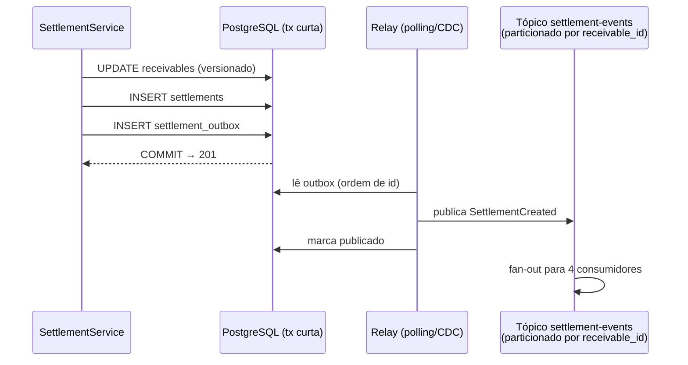

# Proposta de arquitetura orientada a eventos (EDA) para o fluxo de liquidação

> Documento de proposta (staff, §6 do enunciado). **O case não implementa EDA por decisão de escopo**: o §12 pune volume como proxy de qualidade, e um outbox sem consumidor real seria exatamente isso (`DECISIONS.md` §5, ADR 0003). Esta é a evolução desenhada **a partir do monólito real** — o ponto de inserção é um único INSERT na transação curta que já existe.

## 1. O que muda no código atual

Hoje, `SettlementService.settle()` fecha o ato de liquidar numa transação curta: `UPDATE receivables ... WHERE id AND version` → `INSERT settlements`. A evolução adiciona **um terceiro statement na mesma transação** — o INSERT do evento numa tabela `settlement_outbox` (payload = o próprio snapshot autocontido de `settlements`, que já carrega tudo: valores, `fx_rate` copiada, `settled_at`). Nada mais do fluxo síncrono muda: o `201` continua significando "liquidado", e as garantias do ADR 0003 (lock otimista, `ux_settlements_receivable`, `ux_settlements_idem`) permanecem intactas. O evento existe **se e somente se** a liquidação existe — atomicidade de graça, por estar na mesma transação local.

**Relay:** um poller (`SELECT ... WHERE published_at IS NULL ORDER BY id LIMIT n` + `FOR UPDATE SKIP LOCKED` para múltiplas instâncias) ou CDC (Debezium) quando o volume justificar. O relay é **at-least-once por construção**: pode publicar e falhar antes de marcar — duplicata no tópico é esperada, e é por isso que todo consumidor deduplica (§3).

**Particionamento do tópico por `receivable_id`** — a mesma chave natural do design de escala ([`escala-1m-tx-min.md`](escala-1m-tx-min.md) §2d): ordem preservada por recebível, paralelismo entre recebíveis.

## 2. Consumidores (cada um com sua chave de dedupe)

| # | Consumidor | Efeito | Dedupe (efeito-uma-vez) |
|---|---|---|---|
| 1 | **PaymentInstruction** | Gera a instrução de pagamento ao cedente (via administrador/custodiante do FIDC) | **`UNIQUE(settlement_id)`** na tabela de instruções |
| 2 | **Ledger contábil** | Lançamentos de aquisição do direito creditório (PV, deságio) | Chave do lançamento derivada de `settlement_id` |
| 3 | **Projeção do extrato** | Alimenta o read model analítico (hoje: `StatementQueryDao` lê a tabela transacional; aqui vira projeção eventual) | Upsert por `settlement_id` — reaplicar é no-op |
| 4 | **Notificação ao cedente** | E-mail/webhook "sua cessão foi liquidada por R$ X" | Registro de envio por `settlement_id`; reenvio raro é aceitável (não é fronteira de dinheiro) |

O consumidor 1 é o que importa: **a deduplicação na fronteira do dinheiro**. É a resposta sistêmica ao item B.4 do Anexo B — no incidente, três cedentes receberam a mesma liquidação duas vezes porque a única defesa contra duplicidade era o código do endpoint (e ele falhava silenciosamente). Neste desenho, mesmo que o motor, o relay e o broker conspirem para entregar o mesmo evento cinco vezes, a `UNIQUE(settlement_id)` na tabela de instruções garante que **dinheiro sai uma vez**: a duplicata morre a um passo do pagamento, no último ponto onde ainda é um erro barato. Prevenção por invariante de banco, não por disciplina de processo — a mesma filosofia da `ux_settlements_receivable` no motor.

## 3. Semântica: at-least-once com efeito-uma-vez

Exactly-once de entrega não existe entre processos que podem falhar entre "processar" e "confirmar" — então o contrato declarado é honesto:

- **Produção:** o outbox garante que todo settlement gera evento (nenhuma perda) e que pode haver duplicata (nenhuma ilusão).
- **Entrega:** at-least-once, ordenada por `receivable_id` dentro da partição.
- **Consumo:** cada consumidor é idempotente pela própria chave (tabela acima); commit de offset **após** o efeito durável.
- **Falha:** retry com backoff; mensagem envenenada vai a **DLQ com alarme e reprocessamento manual** — nunca descarte silencioso (a lição do `catch` vazio do Anexo A) nem bloqueio da partição inteira.
- **Reprocessamento:** como todo efeito é dedupado, reprocessar o tópico do zero (rebuild da projeção do extrato, auditoria do ledger) é uma operação segura por construção.

## 4. O que este desenho compra — e o que cobra

**Compra:** os quatro efeitos saem do caminho do request (latência do `201` continua sendo a da transação local); cada consumidor escala e falha isoladamente (notificação fora do ar não atrasa instrução de pagamento); novos consumidores (relatório regulatório, risco) entram sem tocar no motor; é o primeiro terço do caminho de extração do ADR 0002 e o mecanismo de alimentação do read model do doc de escala.

**Cobra:** um relay para operar (lag do outbox vira métrica de negócio: `outbox_lag_seconds`), um broker na infraestrutura, consistência eventual visível no extrato (segundos), e testes de contrato por consumidor. É por esse custo — pago sem consumidor real para justificá-lo — que o case entrega o desenho e **não** a implementação.
