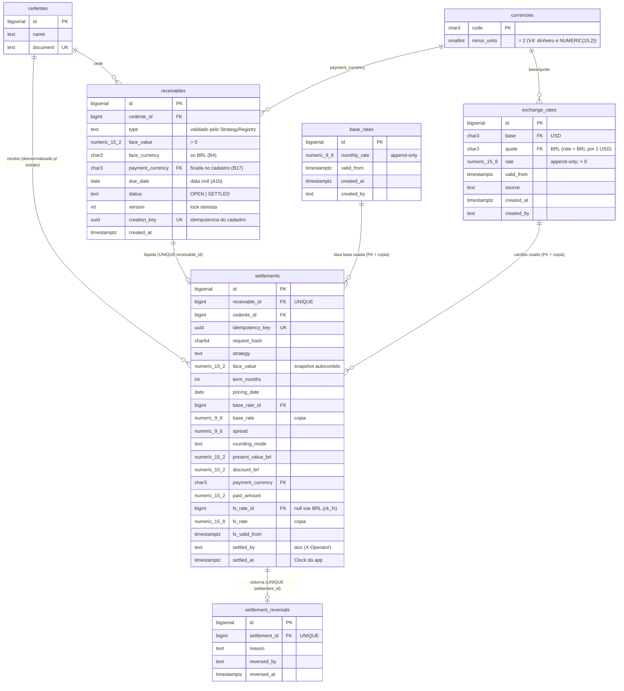

# Diagrama ER

Gerado do schema real (migrations `V1__schema.sql` … `V5__settlement_coherence_checks.sql` —
a V5 amarra a coerência do snapshot: dinheiro positivo e trio `fx_*` todo-ou-nada). Convenções:
dinheiro `NUMERIC(15,2)`, juros `NUMERIC(9,6)`, câmbio `NUMERIC(15,8)`; `base_rates`,
`exchange_rates`, `settlements` e `settlement_reversals` são **append-only** (triggers +
papel `app_rw` na V2).

**Índices de leitura** (igualdade → faixa → id; servem filtro e keyset do extrato):
`ix_st_cedente (cedente_id, settled_at DESC, id DESC)` ·
`ix_st_currency (payment_currency, settled_at DESC, id DESC)` ·
`ix_st_period (settled_at DESC, id DESC)` ·
`ix_fx_asof (base, quote, valid_from DESC, created_at DESC, id DESC)`.
