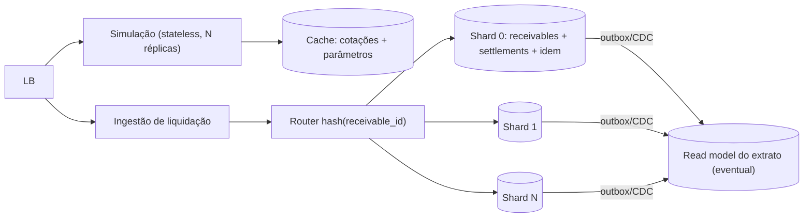

# Design de alta escala — 1 milhão de transações por minuto

> Documento de design (staff, §6 do enunciado). Nada daqui está implementado — o monólito atual atende o escopo do case (ADR 0002). Este doc responde: **o que muda quando a carga cresce 5–6 ordens de grandeza**, e em particular **o que muda na semântica de idempotência**.

## 0. A conta, antes de qualquer arquitetura

1.000.000 tx/min ÷ 60 ≈ **16.666,67 tx/s em média** → **1,44 bilhão/dia**. Tráfego real não é plano: com premissa de pico 3× a média (abertura de mesa, reprocessamento), dimensiona-se para **~50.000 tx/s**. Cada liquidação executa **≥ 2 escritas** (UPDATE do recebível + INSERT do settlement, a transação curta do `SettlementService`) → **≥ 33 mil escritas/s na média, ~100 mil/s no pico**, fora WAL, índices (`ux_settlements_receivable`, `ux_settlements_idem`, 3 índices de extrato) e réplicas.

**O que conta como "transação":** aqui, 1 transação = 1 requisição ao motor, e a premissa de mix é ~95% simulações (leitura pura, mesmo `PricingEngine`) e ~5% liquidações (~830/s média, ~2.500/s pico — ainda assim ordens de magnitude acima de um PostgreSQL único). **Declaração honesta:** 1 M tx/min é hipotético para um FIDC — a carteira inteira de um fundo grande não gera isso em um dia; o número existe para forçar as decisões de arquitetura abaixo, e elas são apresentadas nessa condição.

## 1. Forma geral

**Simulação: stateless, escala horizontal.** O `PricingEngine` é uma função pura (`BigDecimal` in → out); a simulação só precisa de taxa base e cotação vigentes. N réplicas atrás do LB, sem afinidade, sem estado. É onde vive ~95% da carga e é o problema barato.

**Liquidação: escrita forte, sempre.** A transição OPEN→SETTLED com "exatamente uma liquidação por recebível" não relaxa com a escala — o que muda é **onde** a garantia mora (§2).

**Cache — só de cotações e parâmetros, nada mais.** Chave = `par + vigência` (ex.: `USD/BRL@valid_from`), espelhando `ix_fx_asof`; TTL curto e invalidação no POST de nova cotação. Crucial: a liquidação **grava a vigência usada** (`fx_rate_id`, `fx_rate`, `fx_valid_from` no snapshot — como hoje), então cotação servida de cache continua auditável. **Nunca cachear** status de recebível nem resultado de checagem de duplicidade: são exatamente os dados cuja leitura desatualizada produz o incidente do Anexo B — decisão de unicidade se toma no store transacional, nunca num cache.

**Shard por `hash(receivable_id)`.** É a chave natural do domínio: recebível, `Idempotency-Key` da sua liquidação e a linha de `settlements` caem **no mesmo shard**, logo a transação curta continua **local** (UPDATE versionado → INSERT, sem 2PC) e as UNIQUEs (`ux_settlements_receivable`, `ux_settlements_idem`) permanecem válidas **dentro do shard** — que é o único lugar onde precisam valer, pois todo tráfego daquele recebível roteia para lá. Alternativa rejeitada: shard por cedente — distribui melhor o extrato, mas um cedente-âncora do fundo vira **hot shard** no pico de cessão, e a afinidade recebível↔shard é o que preserva a transação local.

**Store de idempotência com TTL = fast-path, nunca fonte da verdade.** Um Redis com `SETNX key TTL` corta o round-trip ao shard para retries quentes (duplo clique, retry de rede em segundos). Mas TTL vencido + retry tardio (job de reprocessamento na segunda-feira) atravessaria o cache e **liquidaria de novo** se o cache fosse a única defesa — a fonte da verdade é a `ux_settlements_idem` no shard, permanente porque é coluna da própria linha (o replay de anos depois ainda encontra a liquidação e responde 200).

**Extrato: read model eventual.** A rota analítica sai do caminho da escrita: projeção alimentada por outbox/CDC (formato em [`eda-liquidacao.md`](eda-liquidacao.md)), particionada **por tempo em `settled_at`** (partições mensais: poda barata, índices menores, o filtro de período do extrato vira partition pruning). Paginação keyset como hoje (`StatementQueryDao`), **sem COUNT exato** — "COUNT(*) de 1,44 bi/dia" não é um requisito, é um bug de produto; exibe-se "mais resultados" ou contagem aproximada com staleness declarada.

**Contrato sob backpressure: `202 + GET`.** Se o pico exigir enfileirar a liquidação, o contrato muda de forma honesta: `202 Accepted` + `Location: /settlements/{idempotencyKey}` para poll; `201/409` síncronos viram estados consultáveis. A matriz de idempotência do `SPEC.md` §4 sobrevive — só que o "replay" passa a poder responder `PENDING`.

## 2. O que muda na semântica de idempotência

Hoje: uma UNIQUE num banco único decide tudo, e `exactly-once` é literal. Em escala:

**(a) A chave vai a um store distribuído com TTL — como fast-path.** A checagem barata acontece na borda (Redis/`SETNX`), mas com semântica rebaixada: o hit evita trabalho, o **miss não prova nada**. Toda decisão final desce ao shard.

**(b) A UNIQUE vira por-shard — e isso basta.** Não existe mais unicidade global num único banco; existe unicidade **no shard dono do `receivable_id`**, e como o roteamento é determinístico por hash, nenhuma requisição do mesmo recebível decide em outro lugar. A garantia global é a composição: roteamento determinístico + UNIQUE local. Corolário: resharding é operação crítica — mover um recebível de shard exige mover settlement e chave juntos, atomicamente.

**(c) Exactly-once vira at-least-once + consumidores idempotentes (efeito-uma-vez).** Com fila e retry entre borda e shard, entregas duplicadas são fato, não falha. A propriedade que se preserva é **efeito-uma-vez**: cada consumidor a jusante deduplica pela sua própria chave natural (a instrução de pagamento por `UNIQUE(settlement_id)` — a fronteira do dinheiro; o ledger pela chave do lançamento). "Processar duas vezes" é aceito; "efetivar duas vezes" não.

**(d) Outbox → broker particionado por `receivable_id`, com DLQ.** A publicação herda a mesma chave de partição, preservando ordem por recebível (SETTLED nunca chega antes de CREATED ao mesmo consumidor). Mensagem envenenada vai a DLQ com alarme — descartá-la silenciosamente seria a versão distribuída do `catch` vazio do Anexo A.

**Síntese:** a idempotência deixa de ser uma propriedade de **um índice** e passa a ser uma propriedade de **composição** — fast-path com TTL (conveniência), UNIQUE por shard (verdade), consumidores com dedupe próprio (efeito) — e o teste que hoje é "duas threads, um banco" vira um teste de contrato por camada.
